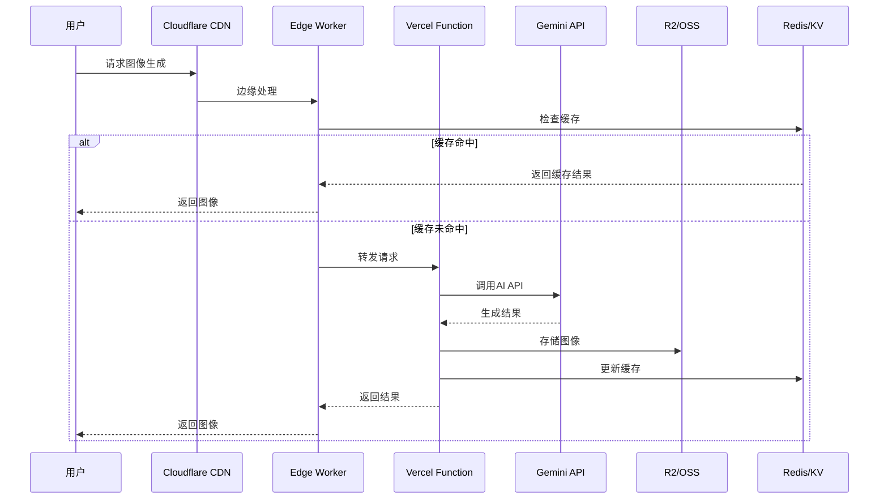
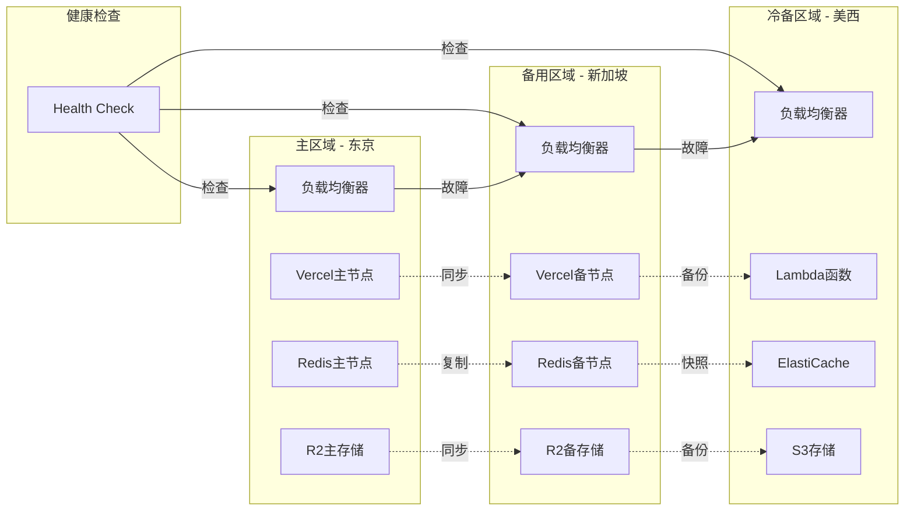
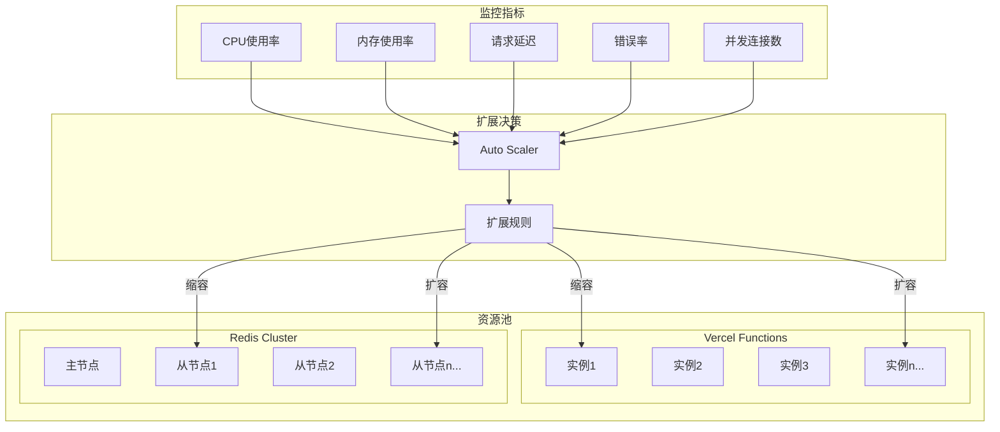
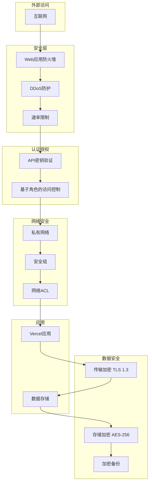
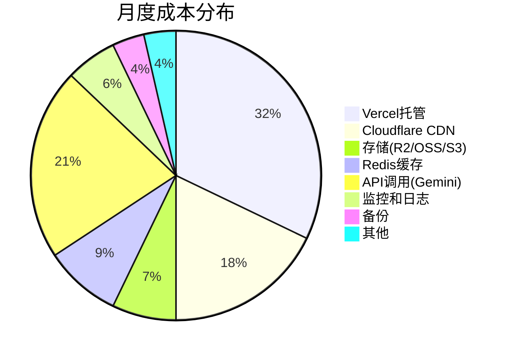
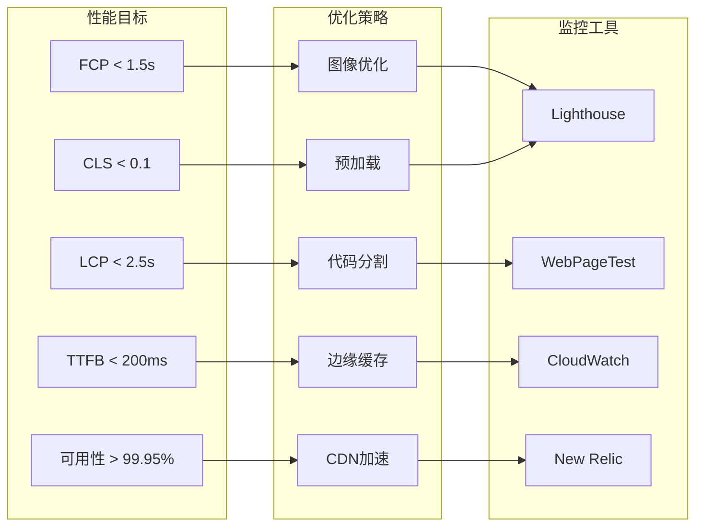
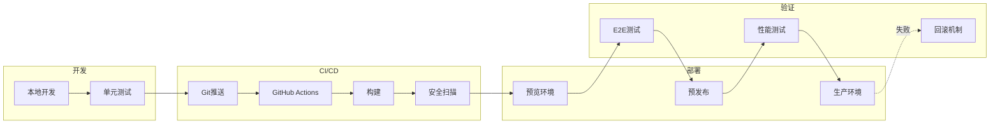

# Gemini Image Toolbox - 云架构图

## 整体架构图

```mermaid
graph TB
    subgraph "用户层"
        U1[全球用户]
        U2[中国用户]
    end
    
    subgraph "CDN层"
        CF[Cloudflare Global CDN]
        CF_CN[Cloudflare China + 京东云]
        ALI_CDN[阿里云CDN]
    end
    
    subgraph "边缘计算层"
        W1[CF Workers - 图像优化]
        W2[CF Workers - API网关]
        W3[CF Workers - 速率限制]
        FC[阿里云函数计算]
    end
    
    subgraph "应用层"
        subgraph "Vercel边缘网络"
            V1[东京 hnd1]
            V2[新加坡 sin1]
            V3[旧金山 sfo1]
            V4[华盛顿 iad1]
            V5[法兰克福 fra1]
        end
    end
    
    subgraph "API层"
        API1[/api/generate]
        API2[/api/generate-image]
        API3[/api/health]
        GEMINI[Google Gemini API]
    end
    
    subgraph "存储层"
        R2[Cloudflare R2]
        OSS[阿里云OSS]
        S3[AWS S3 备份]
    end
    
    subgraph "缓存层"
        KV[CF KV Store]
        REDIS1[AWS ElastiCache]
        REDIS2[阿里云Redis]
    end
    
    subgraph "监控层"
        CW[CloudWatch]
        CF_A[CF Analytics]
        ALI_M[阿里云监控]
    end
    
    U1 --> CF
    U2 --> CF_CN
    U2 --> ALI_CDN
    
    CF --> W1
    CF --> W2
    CF --> W3
    CF_CN --> FC
    ALI_CDN --> FC
    
    W1 --> V1
    W2 --> V2
    W3 --> V3
    FC --> V1
    
    V1 --> API1
    V2 --> API2
    V3 --> API3
    
    API1 --> GEMINI
    API2 --> GEMINI
    
    API1 --> R2
    API2 --> OSS
    R2 -.->|备份| S3
    OSS -.->|同步| R2
    
    V1 --> KV
    V2 --> REDIS1
    FC --> REDIS2
    
    V1 --> CW
    CF --> CF_A
    FC --> ALI_M
```

## 数据流架构



## 故障转移架构



## 自动扩展架构



## 安全架构



## 成本优化架构



## 性能指标架构



## 部署流水线

