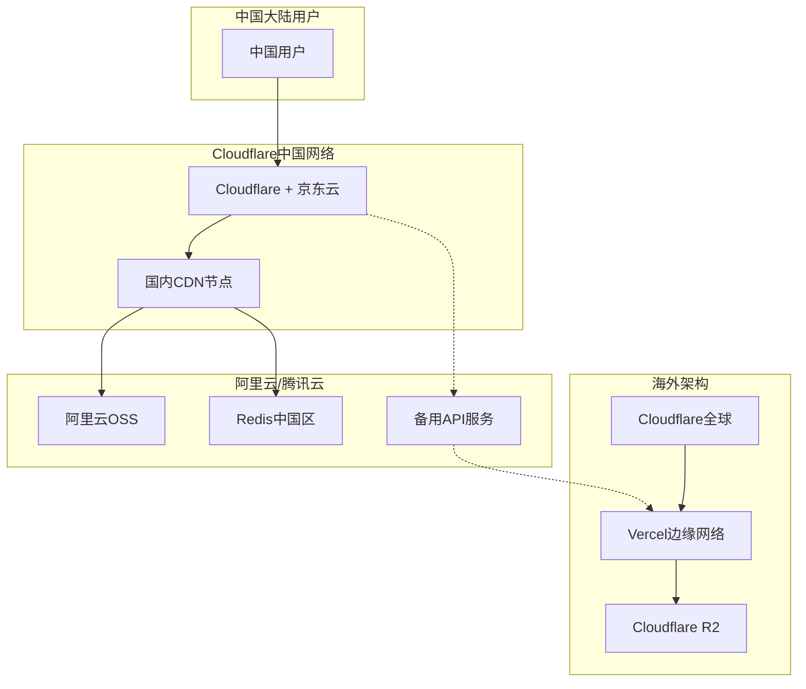

# 中国大陆访问优化方案

## 整体架构

### 双线部署架构


## 具体实施方案

### 1. ICP备案和合规
```yaml
compliance:
  icp_filing:
    required: true
    provider: "阿里云/腾讯云"
    type: "企业备案"
    duration: "15-20个工作日"
    
  requirements:
    - 营业执照
    - 法人身份证
    - 域名证书
    - 服务器租赁合同
    - 网站负责人授权书
    
  security_assessment:
    - 网络安全等级保护(等保2.0)
    - 数据本地化存储
    - 内容审核机制
    - 实名认证(如需要)
```

### 2. CDN加速配置
```javascript
// cdn-china-config.js
module.exports = {
  // 阿里云CDN配置
  aliyun: {
    domain: 'china.yourdomain.com',
    regions: [
      'cn-beijing',    // 华北
      'cn-shanghai',   // 华东
      'cn-guangzhou',  // 华南
      'cn-chengdu',    // 西南
      'cn-hongkong'    // 香港(备用)
    ],
    
    cacheRules: [
      {
        path: '/static/*',
        ttl: 31536000, // 1年
        priority: 100
      },
      {
        path: '/images/*',
        ttl: 604800, // 7天
        priority: 90
      },
      {
        path: '/api/*',
        ttl: 0, // 不缓存
        priority: 80
      }
    ],
    
    // 回源配置
    origin: {
      primary: 'vercel-hnd1.yourdomain.com', // 日本节点(最近)
      backup: 'vercel-sin1.yourdomain.com',  // 新加坡节点
      protocol: 'https',
      port: 443
    },
    
    // 性能优化
    optimization: {
      gzip: true,
      brotli: true,
      http2: true,
      http3: true, // QUIC协议
      智能压缩: true,
      智能预热: true
    }
  },
  
  // 腾讯云CDN配置(备选)
  tencent: {
    domain: 'china-tc.yourdomain.com',
    regions: ['北京', '上海', '广州', '成都', '重庆'],
    edgeNodes: 1000, // 边缘节点数
    bandwidth: '100Gbps'
  }
}
```

### 3. 本地化存储方案
```javascript
// storage-china.js
const storageConfig = {
  // 阿里云OSS
  aliyunOSS: {
    region: 'oss-cn-shanghai',
    bucket: 'gemini-images-china',
    
    // 自动同步配置
    sync: {
      source: 'cloudflare-r2',
      frequency: 'realtime',
      method: 'cross-region-replication'
    },
    
    // 访问配置
    access: {
      internal: 'gemini-images.oss-cn-shanghai-internal.aliyuncs.com',
      public: 'gemini-images.oss-cn-shanghai.aliyuncs.com',
      cdn: 'cdn.china.yourdomain.com'
    },
    
    // 生命周期
    lifecycle: {
      rules: [
        {
          prefix: 'temp/',
          expiration: 7 // 天
        },
        {
          prefix: 'cache/',
          expiration: 30
        }
      ]
    }
  },
  
  // 腾讯云COS
  tencentCOS: {
    region: 'ap-shanghai',
    bucket: 'gemini-images-china',
    
    // 数据处理
    dataProcess: {
      imageMogr2: true, // 图片处理
      watermark: false,
      thumbnail: true
    }
  }
}
```

### 4. 边缘函数本地化
```javascript
// edge-function-china.js

// 使用阿里云函数计算
exports.handler = async (event, context) => {
  const { request } = event;
  
  // IP地理位置判断
  const clientIP = request.clientIP;
  const location = await getIPLocation(clientIP);
  
  // 智能路由
  if (location.country === 'CN') {
    // 中国大陆用户
    return await handleChinaRequest(request);
  } else {
    // 海外用户
    return await handleGlobalRequest(request);
  }
};

async function handleChinaRequest(request) {
  // 使用国内资源
  const config = {
    apiEndpoint: 'https://api-cn.yourdomain.com',
    cdnDomain: 'https://cdn-cn.yourdomain.com',
    ossEndpoint: 'https://oss-cn-shanghai.aliyuncs.com'
  };
  
  // 内容过滤(合规要求)
  const filtered = await contentFilter(request.body);
  
  // 处理请求
  const response = await processRequest(filtered, config);
  
  // 添加中国特定响应头
  response.headers['X-Served-By'] = 'China-Edge';
  response.headers['X-Cache-Region'] = 'CN';
  
  return response;
}

// 内容安全审核
async function contentFilter(content) {
  // 调用阿里云内容安全API
  const safe = await checkContentSafety(content);
  
  if (!safe) {
    throw new Error('内容不符合规范');
  }
  
  return content;
}
```

### 5. 数据库和缓存优化
```yaml
# redis-china-config.yaml
redis_china:
  provider: aliyun
  
  # 主从架构
  master:
    region: cn-shanghai
    zone: cn-shanghai-a
    instance_type: redis.master.small.default
    
  replicas:
    - region: cn-beijing
      zone: cn-beijing-a
    - region: cn-guangzhou
      zone: cn-guangzhou-a
    - region: cn-chengdu
      zone: cn-chengdu-a
  
  # 读写分离
  read_write_splitting:
    enabled: true
    read_weight:
      master: 0
      replicas: 100
  
  # 自动故障转移
  failover:
    enabled: true
    auto_failover: true
    failover_time: 30 # 秒
  
  # 性能配置
  performance:
    maxmemory: 4gb
    maxmemory_policy: allkeys-lru
    timeout: 300
    tcp_keepalive: 60
```

### 6. 网络优化策略
```javascript
// network-optimization-china.js

const networkOptimization = {
  // DNS优化
  dns: {
    providers: [
      'DNSPod', // 腾讯云DNS
      'AliDNS'  // 阿里云DNS
    ],
    智能解析: {
      enabled: true,
      线路类型: ['电信', '联通', '移动', '教育网'],
      解析策略: 'geo-based'
    }
  },
  
  // 多线BGP
  bgp: {
    enabled: true,
    providers: ['电信', '联通', '移动'],
    智能路由: true
  },
  
  // 协议优化
  protocols: {
    http3_quic: true,
    tcp_优化: {
      enabled: true,
      congestion_control: 'bbr',
      fast_open: true
    }
  },
  
  // 预连接和预加载
  preconnect: [
    'https://cdn-cn.yourdomain.com',
    'https://api-cn.yourdomain.com',
    'https://oss-cn-shanghai.aliyuncs.com'
  ],
  
  // 资源优化
  resourceHints: {
    dns_prefetch: true,
    preconnect: true,
    prefetch: true,
    prerender: false // 避免不必要的流量
  }
};
```

### 7. 监控和分析
```javascript
// monitoring-china.js

const monitoringConfig = {
  // 阿里云监控
  aliyun_monitoring: {
    metrics: [
      'cdn_bandwidth',
      'cdn_hit_rate',
      'origin_response_time',
      'user_access_count'
    ],
    
    regions: {
      华北: ['北京', '天津', '河北'],
      华东: ['上海', '江苏', '浙江'],
      华南: ['广东', '广西', '海南'],
      西南: ['四川', '重庆', '云南']
    },
    
    alerts: {
      cdn_hit_rate: {
        threshold: 0.8,
        operator: '<',
        action: 'notify'
      },
      response_time: {
        threshold: 500, // ms
        operator: '>',
        action: 'alert'
      }
    }
  },
  
  // 用户行为分析
  analytics: {
    provider: '百度统计',
    track: [
      'page_views',
      'unique_visitors',
      'bounce_rate',
      'average_duration'
    ]
  }
};
```

## 性能优化建议

### 静态资源优化
1. 使用WebP/AVIF格式图片
2. 启用Brotli压缩
3. 实施懒加载策略
4. 使用字体子集化

### API优化
1. 使用就近的API网关
2. 实施请求合并
3. 启用HTTP/2 Server Push
4. 使用长连接

### 移动端优化
1. 针对2G/3G网络优化
2. 实施离线缓存策略
3. 减少首屏资源大小
4. 使用骨架屏

## 成本预估(人民币/月)

| 服务 | 配置 | 费用 |
|------|------|------|
| 阿里云CDN | 1TB流量 | ¥200 |
| 阿里云OSS | 100GB存储 | ¥30 |
| 阿里云Redis | 4GB内存 | ¥300 |
| 函数计算 | 100万次调用 | ¥100 |
| 云监控 | 基础版 | 免费 |
| **总计** | | **¥630** |

## 实施时间表

### 第1周
- ICP备案申请
- 购买国内云服务
- 配置DNS解析

### 第2-3周
- 部署CDN
- 配置OSS存储
- 设置Redis缓存

### 第4周
- 性能测试
- 监控配置
- 正式上线

## 注意事项

1. **合规要求**: 确保内容符合中国法律法规
2. **数据安全**: 敏感数据需要加密存储
3. **备案维护**: 定期更新备案信息
4. **性能监控**: 持续监控各地区访问质量
5. **成本控制**: 定期审查CDN和存储使用量