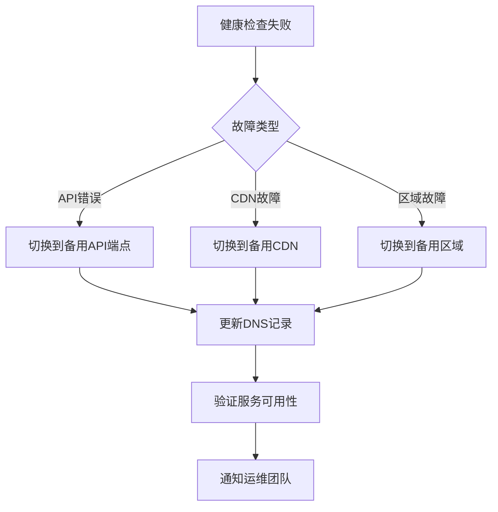

# 灾难恢复计划 - Gemini Image Toolbox

## 恢复目标

- **RTO (Recovery Time Objective)**: 15分钟
- **RPO (Recovery Point Objective)**: 1小时
- **可用性目标**: 99.95% (每月停机时间 < 22分钟)

## 备份策略

### 1. 数据备份架构
```yaml
backup_strategy:
  # 实时备份
  realtime:
    - source: Cloudflare R2
      destination: AWS S3 (跨区域复制)
      frequency: 实时同步
      retention: 30天
    
    - source: Redis Cache
      destination: ElastiCache Snapshots
      frequency: 每小时
      retention: 7天

  # 定期备份
  scheduled:
    - source: Vercel环境变量
      destination: AWS Secrets Manager
      frequency: 每天
      retention: 90天
    
    - source: 数据库 (如果有)
      destination: AWS RDS Snapshots
      frequency: 每6小时
      retention: 30天

  # 代码备份
  code:
    - source: GitHub
      destination: AWS CodeCommit (镜像)
      frequency: 每次提交
      retention: 永久
```

### 2. 多区域部署
```javascript
const multiRegionDeployment = {
  primary: {
    region: 'asia-northeast-1', // 东京
    provider: 'Vercel',
    status: 'active'
  },
  secondary: {
    region: 'us-west-1', // 加州
    provider: 'Vercel',
    status: 'standby'
  },
  tertiary: {
    region: 'eu-central-1', // 法兰克福
    provider: 'AWS Lambda',
    status: 'cold-standby'
  }
};
```

## 故障转移流程

### 自动故障转移


### 手动故障转移步骤
```bash
#!/bin/bash
# disaster-recovery.sh

# 1. 检查主服务状态
check_primary_status() {
    curl -f https://api.yourdomain.com/health || return 1
}

# 2. 激活备用环境
activate_backup() {
    # 更新Cloudflare DNS
    curl -X PUT "https://api.cloudflare.com/client/v4/zones/${ZONE_ID}/dns_records/${RECORD_ID}" \
         -H "Authorization: Bearer ${CF_TOKEN}" \
         -H "Content-Type: application/json" \
         --data '{"type":"CNAME","name":"api","content":"backup.yourdomain.com"}'
    
    # 启动备用Vercel部署
    vercel --prod --force --scope your-team
    
    # 清除CDN缓存
    curl -X POST "https://api.cloudflare.com/client/v4/zones/${ZONE_ID}/purge_cache" \
         -H "Authorization: Bearer ${CF_TOKEN}" \
         -H "Content-Type: application/json" \
         --data '{"purge_everything":true}'
}

# 3. 验证恢复
verify_recovery() {
    for i in {1..10}; do
        if curl -f https://api.yourdomain.com/health; then
            echo "Service recovered successfully"
            return 0
        fi
        sleep 30
    done
    return 1
}

# 主流程
main() {
    if ! check_primary_status; then
        echo "Primary service down, initiating failover..."
        activate_backup
        if verify_recovery; then
            send_notification "Service recovered via failover"
        else
            send_alert "CRITICAL: Failover failed!"
        fi
    fi
}
```

## 恢复程序

### 1. 服务降级方案
```javascript
// service-degradation.js
const degradationLevels = {
  level0: {
    name: '正常运行',
    features: ['all'],
    cache: 'normal'
  },
  level1: {
    name: '轻度降级',
    features: ['core', 'api'],
    disabled: ['analytics', 'recommendations'],
    cache: 'aggressive'
  },
  level2: {
    name: '中度降级',
    features: ['core'],
    disabled: ['api-heavy', 'image-generation'],
    cache: 'maximum',
    staticOnly: false
  },
  level3: {
    name: '严重降级',
    features: ['static'],
    disabled: ['all-dynamic'],
    cache: 'permanent',
    staticOnly: true,
    message: '系统维护中，部分功能暂时不可用'
  }
};
```

### 2. 数据恢复流程
```yaml
data_recovery:
  步骤1_评估:
    - 确定数据丢失范围
    - 识别最近的有效备份
    - 评估恢复时间
  
  步骤2_隔离:
    - 停止写入操作
    - 创建当前状态快照
    - 隔离受影响的系统
  
  步骤3_恢复:
    - 从S3恢复R2数据
    - 从快照恢复Redis
    - 重建搜索索引
    - 验证数据完整性
  
  步骤4_验证:
    - 运行数据一致性检查
    - 执行功能测试
    - 性能基准测试
  
  步骤5_切换:
    - 逐步恢复流量
    - 监控系统指标
    - 确认正常运行
```

## 监控和告警

### 关键指标监控
```javascript
const monitoringMetrics = {
  availability: {
    threshold: 99.5,
    window: '5m',
    alert: 'pagerduty'
  },
  responseTime: {
    p50: 200,  // ms
    p95: 1000, // ms
    p99: 3000, // ms
    alert: 'slack'
  },
  errorRate: {
    threshold: 1, // %
    window: '1m',
    alert: 'email'
  },
  throughput: {
    min: 100, // req/s
    alert: 'slack'
  }
};
```

### 告警升级矩阵
| 严重级别 | 响应时间 | 通知方式 | 负责人 |
|---------|---------|---------|--------|
| P0 - 严重 | 5分钟 | PagerDuty + 电话 | 值班工程师 |
| P1 - 高 | 15分钟 | PagerDuty + Slack | 值班工程师 |
| P2 - 中 | 1小时 | Slack + 邮件 | 开发团队 |
| P3 - 低 | 4小时 | 邮件 | 开发团队 |

## 演练计划

### 月度演练
```yaml
disaster_recovery_drill:
  频率: 每月第一个周三
  时间: 02:00-04:00 UTC
  
  演练内容:
    - 主服务故障切换
    - 数据恢复测试
    - 备份验证
    - 告警系统测试
  
  参与人员:
    - DevOps团队
    - 后端开发
    - 值班工程师
  
  成功标准:
    - RTO < 15分钟
    - RPO < 1小时
    - 零数据丢失
    - 所有告警正常触发
```

## 恢复清单

### 快速恢复检查表
- [ ] 确认故障范围和影响
- [ ] 激活事件响应团队
- [ ] 执行故障转移
- [ ] 验证备用系统运行
- [ ] 通知相关方
- [ ] 监控恢复进度
- [ ] 记录事件详情
- [ ] 执行根因分析
- [ ] 更新恢复文档

## 联系信息

### 紧急联系人
```yaml
contacts:
  primary_oncall:
    name: "值班工程师"
    phone: "+86-xxx-xxxx-xxxx"
    slack: "@oncall"
  
  escalation:
    level1:
      name: "技术主管"
      phone: "+86-xxx-xxxx-xxxx"
      email: "tech-lead@example.com"
    
    level2:
      name: "CTO"
      phone: "+86-xxx-xxxx-xxxx"
      email: "cto@example.com"
  
  vendors:
    vercel:
      support: "enterprise-support@vercel.com"
      phone: "+1-xxx-xxx-xxxx"
    
    cloudflare:
      support: "enterprise@cloudflare.com"
      phone: "+1-xxx-xxx-xxxx"
    
    aws:
      support: "https://console.aws.amazon.com/support"
      phone: "+1-xxx-xxx-xxxx"
```

## 恢复后分析

### 事件报告模板
```markdown
## 事件报告
- **事件ID**: INC-2025-001
- **发生时间**: 2025-01-10 14:30 UTC
- **恢复时间**: 2025-01-10 14:45 UTC
- **影响范围**: API服务不可用
- **受影响用户**: ~1000

### 时间线
- 14:30 - 监控告警触发
- 14:32 - 值班工程师响应
- 14:35 - 执行故障转移
- 14:40 - 服务恢复
- 14:45 - 确认所有功能正常

### 根本原因
[详细的根因分析]

### 改进措施
1. [措施1]
2. [措施2]

### 经验教训
[从事件中学到的经验]
```